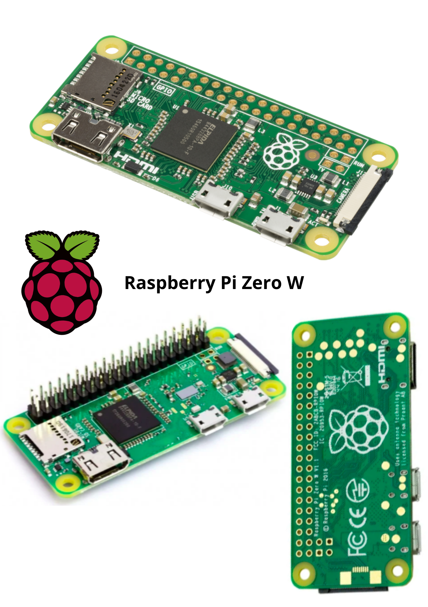
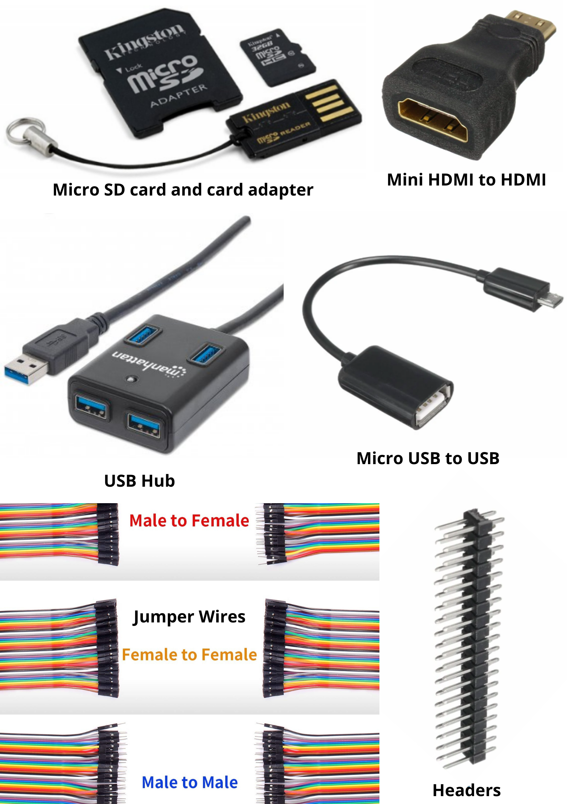
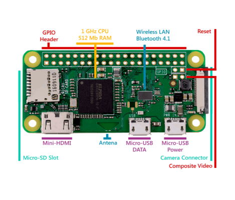
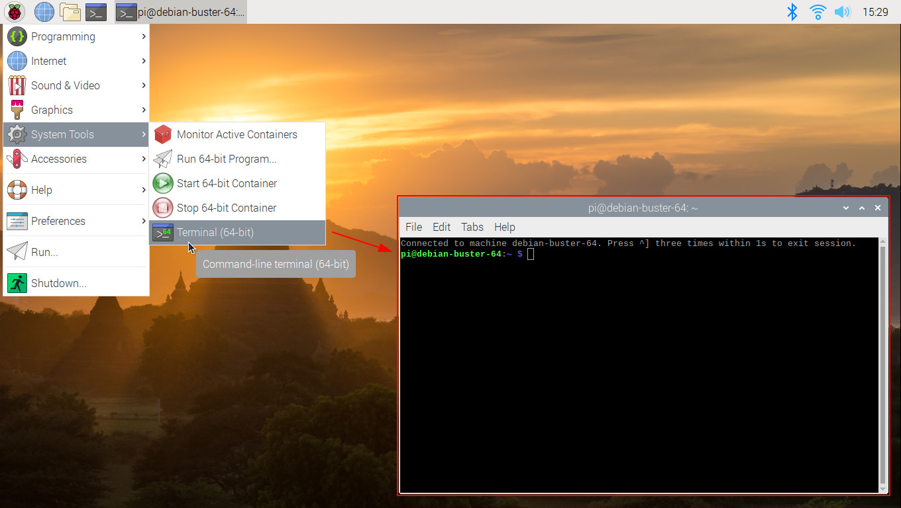

# Raspberry Pi Projects
A series of rpi projects with full explanation, circuit diagrams and real working images.

## Contents:
- [Required Hardware](#required-hardware)
- [Required Hardware Images](#)
- [Accessories](#accessories)
- [Diagrams](#)
- [Raspbian OS](#)

## Required Hardware:
```sh
0. Raspberry Pi Zero W
1. 5V-3A Power Supply Adapter
2. mini HDMI male to HDMI Female Adapter
3. Micro USB to USB Cable
4. GPIO pin header
5. USB Hub (for multiple USB I/O)
```
---

## Required Hardware Images:


---
## Accessories:


---

## Diagrams:
 
 

---

## Raspbian OS


---
---
