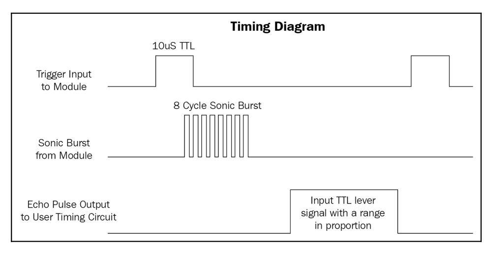

# Interfacing the ultrasonic proximity sensor
A proximity sensor is a type of sensor that senses the proximity of an object
from it. There is a universe full of sensors that are available to accomplish this task and
numerous technologies that allow us to do so. As the name says, the ultrasonic proximity
sensor works on the principal of ultrasonic sound waves. The working principle is quite
easy to understand. The ultrasonic sensor sends a beam of ultrasonic sound waves; these
waves are inaudible to human ears, but nonetheless it is still a sound wave and it also
behaves like a sound wave.

A sound is a wave, hence
it has a speed. Sound waves have a set speed of travel. So, to cover a specific distance, they
take some time. By calculating this time, we can derive how far the sound waves are going
before getting bounced off from a surface.

Similarly, in this sensor, we shoot ultrasonic sound waves in a specific direction and then
sense the echo which bounces back. Naturally, there would be a delay in receiving the echo;
the delay would be directly proportional to the distance of the object from the sensor and,
based on this delay, we could easily compute the distance.

## Ultrasonic Sensor
The physical architecture of the sensor. There are four pins in the sensor, which are:
- VCC (positive)
- Trigger
- Echo
- GND (ground)

Whenever the pin is high for 10 microseconds, the ultrasonic sensor will
send eight cycles of 40 kHz sound waves to the target. Once the trigger cycle is completed,
the ECHO is set to high. Once it receives the echo signal back, the ECHO pin is set back to
low. Here is a diagram to show how it actually happens:

